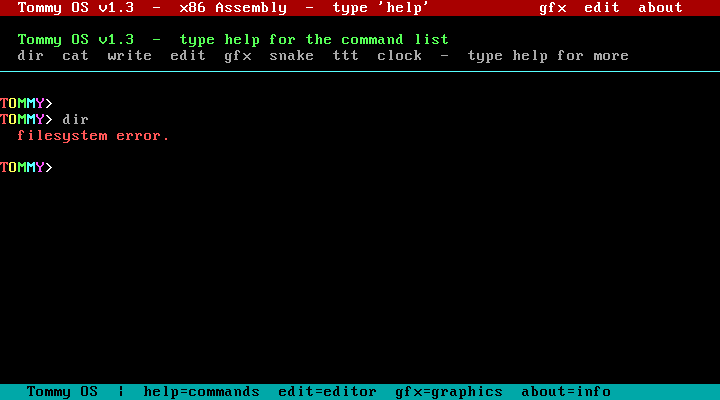
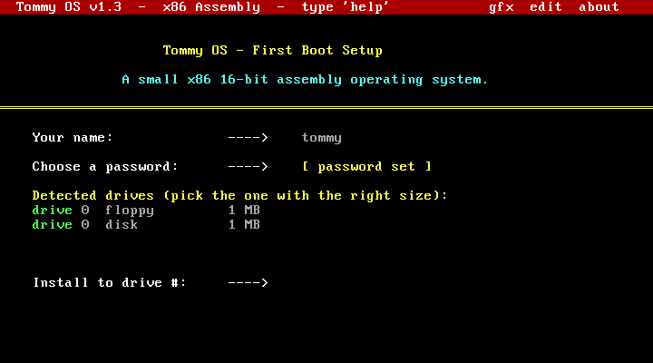
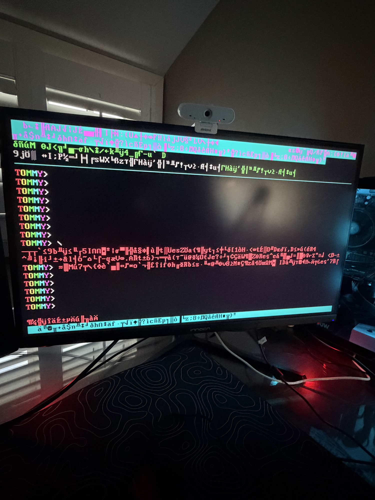

# Tommy OS v1.5

A small x86 16-bit operating system written entirely in assembly (NASM). Boots from a 1.44 MB floppy image or El Torito ISO. Fits in 64 KB.





## Features

- Custom bootloader + kernel in x86 real-mode assembly
- 80×25 VGA text-mode shell with colour UI
- First-boot setup wizard — username, password, drive selection
- Text editor with three modes:
  - Normal editor (blue header)
  - Kernel binary editor `kedit` — live-patches the running OS sectors (red header, Ctrl-W to write)
  - Tommy's C IDE `ide` — keyword cheat-sheet footer (green header)
- Terminal scrollback — PageUp / PageDown to scroll through history
- Built-in commands: `help`, `dir`, `cat`, `write`, `edit`, `gfx`, `snake`, `ttt`, `clock`, `kedit`, `ide`, `about`, `reboot`, `logout`
- Boots on real hardware via USB install script
- Bootable ISO (El Torito floppy-emulation) via `build_iso.py`

## Requirements

| Tool | Purpose | Install |
|------|---------|---------|
| [NASM](https://www.nasm.us/) | Assembler | `winget install NASM.NASM` |
| [QEMU](https://www.qemu.org/) | Emulator | `winget install SoftwareFreedomConservancy.QEMU` |
| Python 3 | ISO builder (optional) | `winget install Python.Python.3` |

## Build & Run

```bat
build.bat        # assembles boot.asm + kernel.asm → build/tommy_os.img
run.bat          # launches QEMU with the floppy image
run.bat w        # windowed mode instead of fullscreen
```

To build a bootable ISO as well:
```bat
python build_iso.py
```

## Install to a USB stick / physical hardware

Run as Administrator:
```bat
install_to_drive.bat
```

The script lists your physical drives, asks you to confirm by index, then requires you to type `YES` before writing. Drive 0 is blocked as a safety measure.

> **Warning:** writing to a physical drive erases it completely. Pick a USB stick you don't mind losing.

## Project layout

```
src/
  boot.asm       — 512-byte bootloader (MBR)
  kernel.asm     — kernel, shell, editor, graphics (64 KB)
build/           — generated by build.bat (gitignored)
screenshots/     — QEMU and real-hardware screenshots
build.bat        — build script (Windows)
run.bat          — QEMU launch script
build_iso.py     — El Torito ISO generator
install_to_drive.bat / install_to_drive.ps1  — physical USB installer
```

## Keyboard shortcuts

| Key | Action |
|-----|--------|
| `Ctrl-W` | Write (save) — in kernel editor, writes back to disk |
| `Ctrl-Q` | Quit editor |
| `Ctrl-R` | Run (in Tommy's C IDE) |
| `PageUp / PageDown` | Scroll terminal history |
| `Ctrl-Alt-G` | Release mouse (QEMU) |
| `Ctrl-Alt-F` | Toggle fullscreen (QEMU) |

## License

MIT
